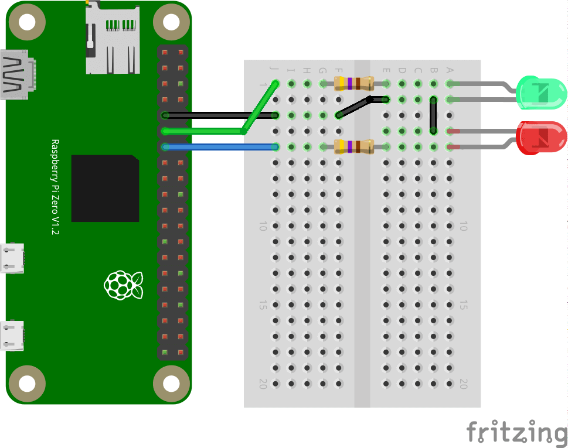

# Simple Webserver for Raspberry PI Zero W

## Circuit



## How to Run

Execute:
```
python3 my-webserver.py
```

This webserver is written in Flask and uses RPi.GPIO to control Raspberry PI GPIO state.

Tested on a Raspberry PI Zero W but should work on any Raspberry PI running September 2019 Raspbian Edition.

Install Flask and RPi.GPIO modules:
```bash
sudo apt install python3-flask python3-rpi.gpio -y
```

